# One year later...
## Debugging
- Ok so my functional tests aren't working... time to find out why...
- Top 3 most tedious exercises of my life
- How to debug your functional tests. 
    - Make your program completely deterministic. 
    - Make base program completely deterministic.
    - Ensure they are deterministic in the same way. Don't forget you need all your arrays to have their contents in the same order...
    ```
    while you_dont_know_wtf_is_wrong
        your_program += log_more_stuff
        your_base_program += log_more_stuff
        compile(your_base_program)
        for (your_log_line, base_log_line) in zip(your_program_logs, base_program_logs)
            compare(your_log_line, base_log_line)
    ```
    - replacing `rand()` with `0.5` is a good start but there are tons of code sections you'll never hit. 
    - Next: 
        - Adding a really simple LCG to get better coverage. LCG is bad for good images, great for reproducability. 
        - Image post processing to analysis to pixel level differences
        - Log post processing to make the logs in identical format to enable programmatic comparison
        - Fix all the junk that this unsurfaces
- The bug! Spot the difference
    - `light = v0.type == VTLight ? v0.ei.light : v0.si.primitive.area_light`
    - `light = v0.type == VTLight ? v0.ei.light : v1.si.primitive.area_light`
- Before & After


- [A blog post on the matter](https://pharr.org/matt/blog/2020/04/26/debugging-intro)

- Unit Tests
    - Would unit tests have solved a lot of pain? For sure. 
    - Would writing good unit tests have taken more time than the writing of the program? At least 2x the work.
    - In my defense, the underlying program had very very light unit test coverage. I did copy most of those unit tests. 

## Parametric Surfaces
- Production Ray Tracing systems are all based on Triangles. It's all triangles. A lot of triangles. Like a lot of them. 
- If you see a perfectly smooth 2d plane? 2 triangles. If you see a cube? 8 triangles. If you see a dragon on House of the Dragon? like 5,000,000 triangles.
- Ray-Triangle intersections are robust & fast. 
- But that's no fun.
- I added finding ray intersections with parametric surfaces (ie a surface which is defined by a parametric function). So you can turn things like this

$ x^4 + y^4 + z^4 + a\left(x^2 + y^2 + z^2\right)^2 + b\left(x^2 + y^2 + z^2\right) + c = 0$
- into images like...

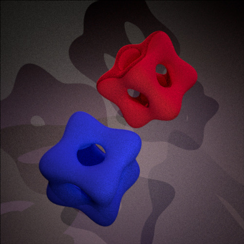
> Side Bar: This scene is currently defined via 4 `Shapes` (2 trianges for the floor, 2 parametric surfaces) & 4 `Lights`. Without parametric surfaces, you'd have to triangulate your surface (not trivial!!!!! - there's a brilliant algorithm to do so but that's a whole bunch of work...) and this scene would be 4 `Lights` and like 500,000+2 `Shapes`
- tldr: use `Roots.solve()` because this is a really just a root finding problem.
    - the hard part was developing good heuristics to bound your search space! or you don't get convergence when you should and it leads to nasty bugs. Which are exacerbated by non-determinism!!
    - Math time

$ x^4 + y^4 + z^4 + a\left(x^2 + y^2 + z^2\right)^2 + b\left(x^2 + y^2 + z^2\right) + c = 0 $
where $ x = o.x + d.x * t, \quad y = o.y + d.y * t, \quad z = o.z + d.z * t$ where $o$ and $d$ are the ray's Origin and Direction

> Side Bar 2: See the weird shading on the top left side of the red surface? Yeah that's wrong. But why? Don't ask me...

- Next:
    - Add more functions
    - Symbolic differentiation instead of analytic derivation

## Participating Medium
- My initial ray tracer assumed that light was traveling in a perfect vacuum. 
- `L *= (1 - Transmittance)` --> Easy when Transmittance is 0, everywhere. 
- Pretty easy when your medium is uniformly dense. Your transmittance is a single number within a defined Shape!


- How to make it not uniformly dense? Specify a 3d point cloud. So instad of $T$ you have $T_{x,y,z}$ Make your transmittance spatially varying. Each point in space is a density value.

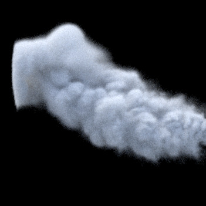
- This works by putting all your densities into an array then indexing into that array. Ezpz. What happens with the # of points you need to specify is really big? What about really really big? Not good! Thankfully there are smarter people than I out there who have created data structures to solve this problem!
    - [OpenVDB](https://github.com/AcademySoftwareFoundation/openvdb) is a production grade sparse volumetric data structure. Thankfully they also provide NanoVDB which are the minimal header files that make compilation way easier. 
    - I wrote Julia bindings for the underlying c++ headers so I can render scenes like...


- This is the most fragile, hacky thing I have ever built. I am afraid to breath around this code or look at it wrong, it might stop working. 
## Sobol Sampler
- Getting good high dimension random numbers is not trivial. 
- TRUE random isn't good. You can get unlucky and have samples "clump" together. Which leads to unwanted visual patterns. 
- `rand()` can and does clump. (and isn't well distributed in high dimensions)

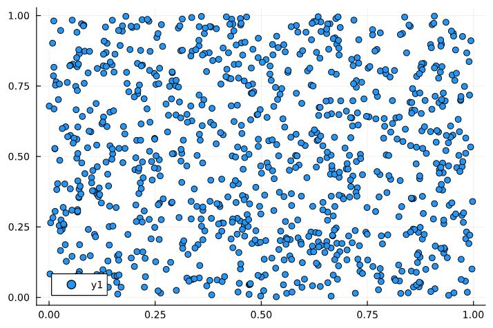
- Solving clumping is easy. Partition your space into an N-deimensional grid. Here is it is N^2 grid. Then within each gridn use `rand()`. This is called stratified sampling. Easy and decent.

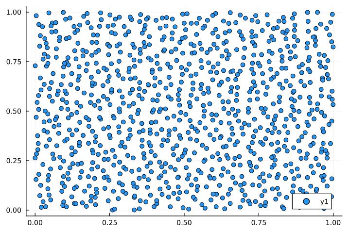
- The cool art and science of using smarter pseudo random number generators to ensure samples NOT random but instead patterned & artifacted in a way the human eye "likes"

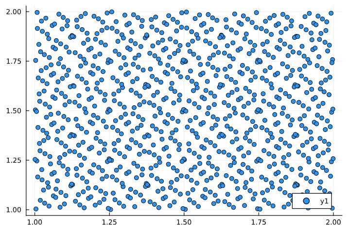

> Great example of why debugging these systems is so hard. There's likely a bug in ^^ this image. See that extra clumping? SUSPICIOUS. How on earth would I have ever caught that otherwise...


- [Here is a cool blog post](https://psychopath.io/post/2022_07_24_owen_scrambling_based_dithered_blue_noise_sampling) They describe the goal as not necessarily reducing the noise but re-distrubting the noise in a way that makes the errors more visually pleasing to the human perception.

## Mipmap: *Multum in parvo*
- The idea is to pre-compute downsized copies of an images to improve visual aliasing when rendering. Sample from a lower resolution image when the viewing angle is smaller. 
- +33% memory footprint

$\sum_{\inf}^{k=0} ar^k = \frac{a}{1-r} $ where $r = \left(\frac{1}{2}\right)^2$ and $a=1$ $\rightarrow{} \frac{1}{1-0.25} = 1.33333$

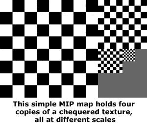

- +???% visual improvement

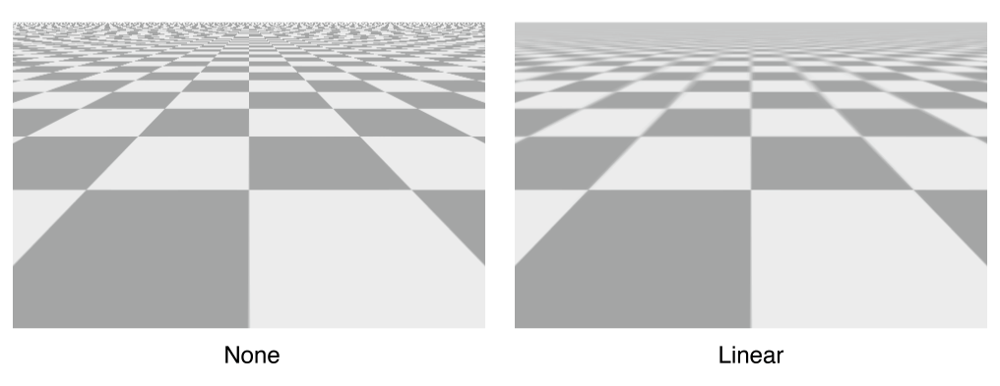

> Who has ever noticed how Google Maps tiles render in large blurry chunks when you're on low connection? I bet you $5 that's a Mipmap (or something similar...)

## Bilinear patch
- It's a fancy word for Rectangles. 
- Triangles are parameterized by 3 points in 3-d space. Bilinear Patches are parameterized by 4 points. 
- Technically rectangles are a special case of Bilinear Patches when all 4 points are co-planar.
- The main benefit is that it makes specifiying rectangles in my `scene_builder.jl` file easier for me. 

## L sytem
- What is an L-System? Let's ask [Wikipedia](https://en.wikipedia.org/wiki/L-system)

```
An L-system or Lindenmayer system is a parallel rewriting system and a type of formal grammar. An L-system consists of an alphabet of symbols that can be used to make strings, a collection of production rules that expand each symbol into some larger string of symbols, an initial "axiom" string from which to begin construction, and a mechanism for translating the generated strings into geometric structures.
```

- What does an L-System look like?

```
variables : X F
constants : + − [ ]
start  : X
rules  : (X → F+[[X]-X]-F[-FX]+X), (F → FF)
angle  : 25°
```
- or in my `scene_file.jl`
```        
d1 = Dict("X" => "F+[[X]-X]-F[-FX]+X", "F" => "FF")
lsystem_shapes = LSystem(d1, "X", 3)
for (i, cyl) in enumerate(lsystem_shapes)
    if i % 2 == 0                
        push!(primitives, Primitive(cyl, mat_julia_red, nothing))
    else
        push!(primitives, Primitive(cyl, mat_julia_green, nothing))
    end
end
```
- Which yields the plant-thing in the middle of this scene. Leaves are a WIP.

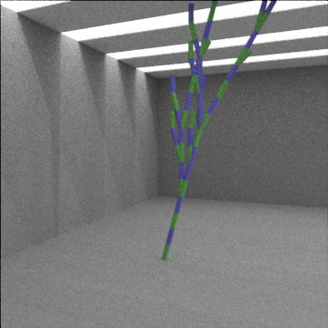 

# Light Sampling
- When you bounce lights around your scene, the light influence at a 3d point is space is a function of all lights in your scene. Instead of calculating the influence of all lights for every point you could sample one light and on average you'll get it right. 
- How you sample is not trivial!
    - Uniform - O(1) - super simple but noisy
    - Power - O(1) - super simple and slightly less noisy - easy win
    - Silly Naive ideas like: Sample lights proportionally to their proximity to the point you're sampling at. Looks great, super slow. Gotta calculate that proximity which is expensive - O(N) - great visual performance
    - Voxel grid - AKA a pre-computed spatial luminance cache - O(1) but lots of memory. When your voxels are too low a resolution it can be the worst!
    - Light BVH - really not easy - O(log n) - SOTA great performance but complicated

| Method          | % Reduction RMSE | % Time decrease | % Allocation decrease |
|-----------------|------------------|-----------------|-----------------------|
| Uniform         | 0%               | 0%              | 0%                    |
| Power           | 24%              | -11%            | -15%                  |
| Centroid-Distance| 7%              | 1%              | 4%                    |
| Voxels-125      | 18%              | -3%             | 0%                    |
| Voxels-512      | 22%              | 1%              | 0%                    |
| Voxels-1000     | 5%               | -3%             | 0%                    |
| Voxels-2197     | -6%              | -2%             | 0%                    |

- I bet you $5 I'm doing something silly in my `Power` distribution and can cut those allocations and run time back to ~+0%


## Baseline

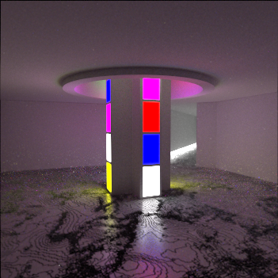

## Uniform

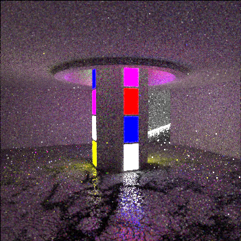

## Power

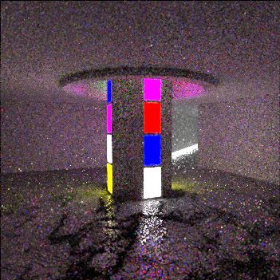

## Centroid Distance

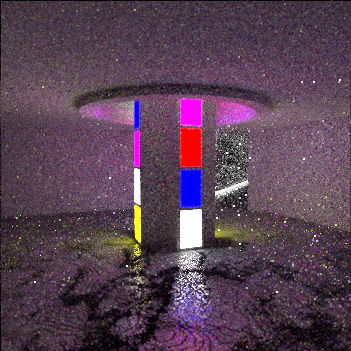

## Voxel: n=5^3=125

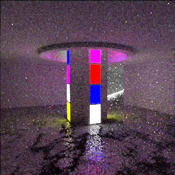

## Voxel: n=8^3=512

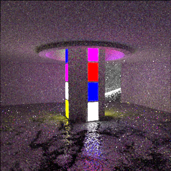

## Voxel: n=10^3=1000

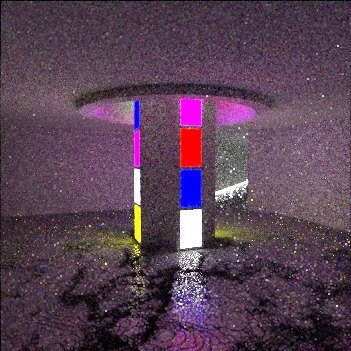

## Voxel: n=13^3=2197

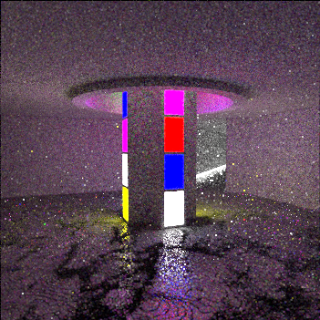


# What's next
- Simulating the sky!
    - Build your own environment map! As described here: [Scatch a Pixel: Simulating the Colords of the Sky](https://www.scratchapixel.com/lessons/procedural-generation-virtual-worlds/simulating-sky/simulating-colors-of-the-sky.html)
    - Then you could create custom images to illuminate your scene with. Specifying time of day and various atmospheric effects. 

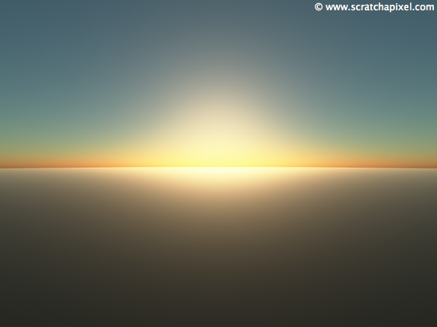 
- [2d images to 3d meshes](https://huggingface.co/stabilityai/stable-fast-3d?utm_campaign=The%20Batch&utm_medium=email&_hsenc=p2ANqtz-9iAyEUD5YaIr85bzwXNYqjDQ1ToAVZ3OuwWz9qDg0B1DTxV6R_0yG8pdmY6_YU2H9FCg5UmXXneBRnVr5niYhtAlt9KA&_hsmi=324223391&utm_content=324223570&utm_source=hs_email) is a burgeoning field of ML. Lot's of work to get the models set up and running locally, then their output translated translated into something my software can work with. Then I could take pictures of things and have infinite scenes to render!
- Float32
    - I tried converting my program to use Float32. It was ton of work and produced no speed up. So that's annoying. I am probably doing something wrong because on contrived examples Float32 calculations are faster...
- Performance deep dive
    - Tracking down hidden allocations
        - Triangle example: I was accidently allocating an array when I should have been using a tuple. This caused extra allocations in probably the hottest path within my program. 10% speed up in my overall program from this one line change. 
    - Bump Allocators: Bring your own stack
        - inb4 why aren't you using a non GC language
    - Some Julia stuff like Texture parameterization. Which of the two specifications is better? idk.
```
const TextureType = Union{Float64, Spectrum}
abstract type AbstractTexture end
struct ConstantTexture{T <: TextureType} <: Texture
    value::T
end
function (c::ConstantTexture{T})(si::SurfaceInteraction)::T where T <: TextureType
    return c.value
end
struct MatteMaterial <: Material
    Kd::Texture  # really this should be spectral
    sigma::Texture  # really this should be float
end
```
or
```
abstract type Texture end
abstract type FloatTexture <: Texture end
abstract type SpectrumTexture <: Texture end
struct ConstantFloatTexture <: FloatTexture
    value::Float64
end
struct ConstantSpectrumTexture <: SpectrumTexture
    value::Spectrum
end
struct MatteMaterial{S <: SpectrumTexture, F <: FloatTexture} <: Material
    Kd::S
    sigma::F
end
```
- Displacement maps
    - [StackExchange](https://math.stackexchange.com/questions/1071662/surface-normal-to-point-on-displaced-sphere)
    so I can render things like THIS which is specified by a base sphere then displacement function (not dissimilar from the Parametric Surfaces I mentioned above)

    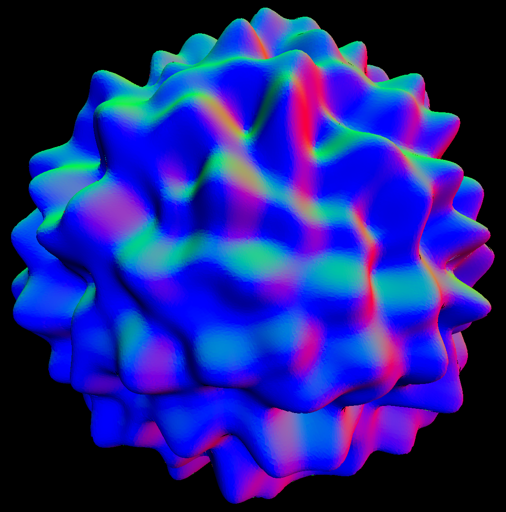
- Denoising algorithms
    - Here is a nice blog post with enough to keep me busy for a life time: [RayTracing Denoising](https://alain.xyz/blog/ray-tracing-denoising)
    - I have already started implementing algorithms from the 90s. The idea is you want to blur things, but not blur across edges. 
    - There's a lot of opportunites for applying ML models. 